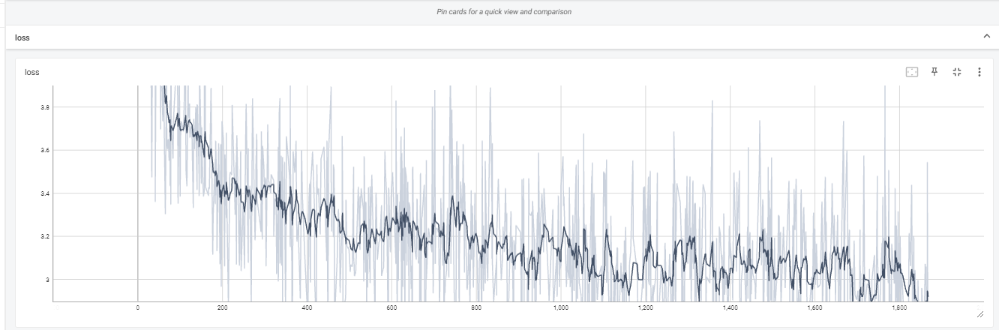

# Gemma-SFT
Gemma-SFT(谷歌, Google), gemma-2b/gemma-7b微调(transformers)/LORA(peft)/推理

## 项目地址
 - [https://github.com/yongzhuo/gemma-sft](https://github.com/yongzhuo/gemma-sft)
 - ***全部weights要用fp32/tf32***, 使用fp16微调十几或几十的步数后大概率loss=nan;(即便layer-norm是fp32也不行, LLaMA就没有这个问题; 大概率是权重精度问题, gemma官方分发的权重是bfloat16，精度比fp16还低)

## 备注
```python
1. 非常重要: 全部weights要用fp32/tf32, 使用fp16微调十几或几十的步数后大概率loss=nan;(即便layer-norm是fp32也不行, LLaMA就没有这个问题; 大概率是权重精度问题, gemma官方分发的权重是bfloat16，精度比fp16还低)
2. transformers需要4.38及以上;
3. gemma词典大小为25w,多语言版本,包含繁/简体;
4. gemma网络架构同Llama, gemma-2b为18层网络, gemma-7b为28层网络; 
5. prompt:
   5.1 标准格式为: 
bos + input + eos + bos + output + eos
   5.2 prompt格式为: 
<start_of_turn>user
input<end_of_turn>
<start_of_turn>model
output<end_of_turn>

6 微调输入输出:
    输入："<start_of_turn>user\n{问题}<end_of_turn>\n"
    输出："<start_of_turn>model\n{答案}<end_of_turn>"
7 推理输入输出(assistant\n放置位置不同):
    输入："<start_of_turn>user\n{问题}<end_of_turn>\n<start_of_turn>model\n"
    输出："{答案}<end_of_turn>"
8. 网络各层名称
('model.embed_tokens.weight', torch.bfloat16, True)
......
('model.layers.17.self_attn.q_proj.weight', torch.bfloat16, True)
('model.layers.17.self_attn.k_proj.weight', torch.bfloat16, True)
('model.layers.17.self_attn.v_proj.weight', torch.bfloat16, True)
('model.layers.17.self_attn.o_proj.weight', torch.bfloat16, True)
('model.layers.17.mlp.gate_proj.weight', torch.bfloat16, True)
('model.layers.17.mlp.up_proj.weight', torch.bfloat16, True)
('model.layers.17.mlp.down_proj.weight', torch.bfloat16, True)
('model.layers.17.input_layernorm.weight', torch.bfloat16, True)
('model.layers.17.post_attention_layernorm.weight', torch.bfloat16, True)
......
('model.norm.weight', torch.bfloat16, True)
9. RuntimeError: unscale_() has already been called on this optimizer since the last update().
    微调语料太少导致的
```

## 环境配置
```shell
transformers>=4.38.1
torch>=1.13.1
safetensors>=0.4.1
accelerate==0.27.1
fsspec==2023.9.2
rouge==1.0.1
nltk==3.6.6
peft>=0.2.0
numpy
tqdm
```

## 微调
```shell
地址: gemma_sft/ft_gemma

配置: gemma_sft/ft_gemma/config.py
训练: python train.py
推理: python predict.py
验证: python evaluation.py
接口: python post_api.py
```

## 微调日志-advgen
 


## 推理日志-advgen
```cpu
请输入:
类型#上衣*颜色#黑色*颜色#紫色*风格#性感*图案#字母*图案#文字*图案#线条*图案#刺绣*衣样式#卫衣*衣长#短款*衣袖型#落肩袖*衣款式#连帽
请稍等...
################################################################################################################################
{'instruction': '类型#上衣*颜色#黑色*颜色#紫色*风格#性感*图案#字母*图案#文字*图案#线条*图案#刺绣*衣样式#卫衣*衣长#短款*衣袖型#落肩袖*衣款式#连帽', 'input': '', 'output': ''}
tensor([[     2,  23055, 235345, 235502, 236524, 235287,  43972, 235345,  57988,
         235287,  43972, 235345, 124945, 235287,  60525, 235345, 135994, 235287,
         182148, 235345, 125156, 235287, 182148, 235345,  25047, 235287, 182148,
         235345, 179958, 235287, 182148, 235345, 237164, 240872, 235287, 236524,
          95243, 235345, 237587, 236524, 235287, 236524, 236045, 235345, 236809,
         236604, 235287, 236524, 237785, 235954, 235345, 236362, 238047, 237785,
         235287, 236524, 166242, 235345, 236557, 238229]])
一款个性吸睛的连帽服務卫衣，黑色系底色，增添了甜美小性感；经典的落肩短款版型，修饰出纤细的颈脖线条；个性时尚的连帽设计，搭配字母刺绣装饰，增添了甜美少女感；肩部的字母刺绣装饰，增添了时尚感，使整体更具特色；紫色的刺绣设计，丰富了视觉感，使整体更具个性。<eos>
请输入:
类型#上衣*风格#街头*图案#创意*衣样式#卫衣
请稍等...
################################################################################################################################
{'instruction': '类型#上衣*风格#街头*图案#创意*衣样式#卫衣', 'input': '', 'output': ''}
tensor([[     2,  23055, 235345, 235502, 236524, 235287,  60525, 235345, 218295,
         235287, 182148, 235345,  50259, 235287, 236524,  95243, 235345, 237587,
         236524]])
这一款卫衣采用经典的领口设计，不拘一格的设计，展现出街头风。领口的设计，不仅能够修饰脸型，还能够打造出精致的小脸，而且还能够起到遮挡口型的效果，让脸型更加小巧。领口处采用了创意的圆环装饰，让整个卫衣更加丰富，视觉上更加亮眼。卫衣采用宽大的版型设计，不挑人穿，即使是身材不那么好的人也能轻松驾驭。<eos>
请输入:
```

## 数据集-中文
 - [https://huggingface.co/datasets/JosephusCheung/GuanacoDataset](https://huggingface.co/datasets/JosephusCheung/GuanacoDataset)
 - [https://huggingface.co/datasets/shareAI/shareGPT_cn](https://huggingface.co/datasets/shareAI/shareGPT_cn)
 - [https://huggingface.co/datasets/Mutonix/RefGPT-Fact](https://huggingface.co/datasets/Mutonix/RefGPT-Fact)
 - [https://huggingface.co/datasets/BAAI/COIG](https://huggingface.co/datasets/BAAI/COIG)
 - [https://github.com/Instruction-Tuning-with-GPT-4/GPT-4-LLM](https://github.com/Instruction-Tuning-with-GPT-4/GPT-4-LLM)
 - [https://github.com/carbonz0/alpaca-chinese-dataset](https://github.com/carbonz0/alpaca-chinese-dataset)
 - [https://github.com/LianjiaTech/BELLE](https://github.com/LianjiaTech/BELLE)
 - [https://github.com/PhoebusSi/Alpaca-CoT](https://github.com/PhoebusSi/Alpaca-CoT)
 - [https://github.com/Hello-SimpleAI/chatgpt-comparison-detection](https://github.com/Hello-SimpleAI/chatgpt-comparison-detection)
 - [https://github.com/yangjianxin1/Firefly](https://github.com/yangjianxin1/Firefly)
 - [https://github.com/XueFuzhao/InstructionWild](https://github.com/XueFuzhao/InstructionWild)
 - [https://github.com/OpenLMLab/MOSS](https://github.com/OpenLMLab/MOSS)
 - [https://github.com/thu-coai/Safety-Prompts](https://github.com/thu-coai/Safety-Prompts)
 - [https://github.com/LAION-AI/Open-Assistant](https://github.com/LAION-AI/Open-Assistant)
 - [https://github.com/TigerResearch/TigerBot](https://github.com/TigerResearch/TigerBot)


## 参考/感谢
 - [https://github.com/google/gemma_pytorch](https://github.com/google/gemma_pytorch)
 - [https://huggingface.co/google/gemma-2b-it](https://huggingface.co/google/gemma-2b-it)
 - [https://huggingface.co/spaces/HuggingFaceH4/open_llm_leaderboard](https://huggingface.co/spaces/HuggingFaceH4/open_llm_leaderboard)
 - [https://github.com/THUDM/ChatGLM-6B](https://github.com/THUDM/ChatGLM-6B)
 - [https://github.com/THUDM/GLM](https://github.com/THUDM/GLM)
 - [https://github.com/tatsu-lab/stanford_alpaca](https://github.com/tatsu-lab/stanford_alpaca)
 - [https://github.com/LianjiaTech/BELLE](https://github.com/LianjiaTech/BELLE)
 - [https://github.com/huggingface/peft](https://github.com/huggingface/peft)
 - [https://github.com/mymusise/ChatGLM-Tuning](https://github.com/mymusise/ChatGLM-Tuning)
 - [https://github.com/bojone/bert4keras](https://github.com/bojone/bert4keras)
 - [trl](https://github.com/lvwerra/trl)
 - [math23k](https://aclanthology.org/D17-1088)


