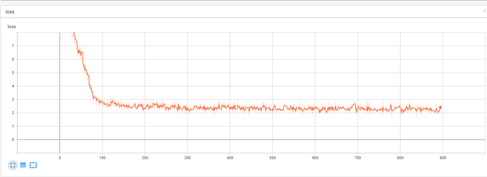

# Gemma-SFT
Gemma-SFT(谷歌, Google), gemma-2b/gemma-7b微调(transformers)/LORA(peft)/推理

## 日志
 - v1, 20240222, transformers==4.38.0时候, 微调只跑通了gemma-2b-it(因为只计算了output的loss, 且使用的是fp16), 同时该版本transformers实现有些问题, 比如说1.tokenizer要加bos, 2.RoPE计算精度问题(float32), 3.激活函数gelu_pytorch_tanh;
 - v2, 20240407, 微调跑通了gemma-7b-it, 精度至少得bf16, 且loss必须计算input输入的;

## 项目地址
 - [https://github.com/yongzhuo/gemma-sft](https://github.com/yongzhuo/gemma-sft);
 - ***全部weights要用bf16/fp32/tf32***, 使用fp16微调十几或几十的步数后大概率loss=nan;(即便layer-norm是fp32也不行, Gemma在这点上就有点娇气了);
 - 强烈建议微调SFT的时候同预训练PT, ***要计算inputh和output的损失函数Loss***, ADVGEN数据集中如果只计算Output的Loss, 会学不到东西;

## 备注
```python
0. gemma-7b的loss计算要包括input和output, 否则可能不收敛(gemma-7b-it模型);
1. 非常重要: 全部weights要用bf16/fp32/tf32, 使用fp16微调十几或几十的步数后大概率loss=nan;(即便layer-norm是fp32也不行, LLaMA就没有这个问题, 原因暂时未知)
2. transformers需要4.38及以上;
3. gemma词典大小为25w,多语言版本,包含繁/简体;
4. gemma网络架构同Llama, gemma-2b为18层网络, gemma-7b为28层网络; 
5. prompt:
   5.1 标准格式为: 
bos + input + eos + bos + output + eos
   5.2 prompt格式为: 
<start_of_turn>user
input<end_of_turn>
<start_of_turn>model
output<end_of_turn>

6 微调输入输出:
    输入："<start_of_turn>user\n{问题}<end_of_turn>\n"
    输出："<start_of_turn>model\n{答案}<end_of_turn>"
7 推理输入输出(assistant\n放置位置不同):
    输入："<start_of_turn>user\n{问题}<end_of_turn>\n<start_of_turn>model\n"
    输出："{答案}<end_of_turn>"
8. 网络各层名称
('model.embed_tokens.weight', torch.bfloat16, True)
......
('model.layers.17.self_attn.q_proj.weight', torch.bfloat16, True)
('model.layers.17.self_attn.k_proj.weight', torch.bfloat16, True)
('model.layers.17.self_attn.v_proj.weight', torch.bfloat16, True)
('model.layers.17.self_attn.o_proj.weight', torch.bfloat16, True)
('model.layers.17.mlp.gate_proj.weight', torch.bfloat16, True)
('model.layers.17.mlp.up_proj.weight', torch.bfloat16, True)
('model.layers.17.mlp.down_proj.weight', torch.bfloat16, True)
('model.layers.17.input_layernorm.weight', torch.bfloat16, True)
('model.layers.17.post_attention_layernorm.weight', torch.bfloat16, True)
......
('model.norm.weight', torch.bfloat16, True)
9. RuntimeError: unscale_() has already been called on this optimizer since the last update().
    微调语料太少导致的
```

## 环境配置
```shell
transformers>=4.38.1
torch>=1.13.1
safetensors>=0.4.1
accelerate==0.27.1
fsspec==2023.9.2
rouge==1.0.1
nltk==3.6.6
peft>=0.2.0
numpy
tqdm
```

## 微调
```shell
地址: gemma_sft/ft_gemma

配置: gemma_sft/ft_gemma/config.py
训练: python train.py
推理: python predict.py
验证: python evaluation.py
接口: python post_api.py
```

## 数据集-中文
 - [https://huggingface.co/datasets/JosephusCheung/GuanacoDataset](https://huggingface.co/datasets/JosephusCheung/GuanacoDataset)
 - [https://huggingface.co/datasets/shareAI/shareGPT_cn](https://huggingface.co/datasets/shareAI/shareGPT_cn)
 - [https://huggingface.co/datasets/Mutonix/RefGPT-Fact](https://huggingface.co/datasets/Mutonix/RefGPT-Fact)
 - [https://huggingface.co/datasets/BAAI/COIG](https://huggingface.co/datasets/BAAI/COIG)
 - [https://github.com/Instruction-Tuning-with-GPT-4/GPT-4-LLM](https://github.com/Instruction-Tuning-with-GPT-4/GPT-4-LLM)
 - [https://github.com/carbonz0/alpaca-chinese-dataset](https://github.com/carbonz0/alpaca-chinese-dataset)
 - [https://github.com/LianjiaTech/BELLE](https://github.com/LianjiaTech/BELLE)
 - [https://github.com/PhoebusSi/Alpaca-CoT](https://github.com/PhoebusSi/Alpaca-CoT)
 - [https://github.com/Hello-SimpleAI/chatgpt-comparison-detection](https://github.com/Hello-SimpleAI/chatgpt-comparison-detection)
 - [https://github.com/yangjianxin1/Firefly](https://github.com/yangjianxin1/Firefly)
 - [https://github.com/XueFuzhao/InstructionWild](https://github.com/XueFuzhao/InstructionWild)
 - [https://github.com/OpenLMLab/MOSS](https://github.com/OpenLMLab/MOSS)
 - [https://github.com/thu-coai/Safety-Prompts](https://github.com/thu-coai/Safety-Prompts)
 - [https://github.com/LAION-AI/Open-Assistant](https://github.com/LAION-AI/Open-Assistant)
 - [https://github.com/TigerResearch/TigerBot](https://github.com/TigerResearch/TigerBot)


## 参考/感谢
 - [https://github.com/google/gemma_pytorch](https://github.com/google/gemma_pytorch)
 - [https://huggingface.co/google/gemma-2b-it](https://huggingface.co/google/gemma-2b-it)
 - [https://huggingface.co/spaces/HuggingFaceH4/open_llm_leaderboard](https://huggingface.co/spaces/HuggingFaceH4/open_llm_leaderboard)
 - [https://github.com/THUDM/ChatGLM-6B](https://github.com/THUDM/ChatGLM-6B)
 - [https://github.com/THUDM/GLM](https://github.com/THUDM/GLM)
 - [https://github.com/tatsu-lab/stanford_alpaca](https://github.com/tatsu-lab/stanford_alpaca)
 - [https://github.com/LianjiaTech/BELLE](https://github.com/LianjiaTech/BELLE)
 - [https://github.com/huggingface/peft](https://github.com/huggingface/peft)
 - [https://github.com/mymusise/ChatGLM-Tuning](https://github.com/mymusise/ChatGLM-Tuning)
 - [https://github.com/bojone/bert4keras](https://github.com/bojone/bert4keras)
 - [trl](https://github.com/lvwerra/trl)
 - [math23k](https://aclanthology.org/D17-1088)


## 微调日志-advgen(gemma-7b)
 

## 微调日志-advgen(gemma-2b)
 


## 推理日志-advgen(gemma-7b)
```cpu
......
('base_model.model.base_model.model.model.layers.27.self_attn.v_proj.weight', torch.bfloat16, False, tensor([[-6.2866e-03,  3.0670e-03, -2.0599e-03,  ...,  2.7847e-04,
         -4.3335e-03,  3.3875e-03],
        [ 3.5286e-04, -8.6670e-03, -2.3804e-03,  ..., -7.9346e-03,
         -3.4027e-03,  6.5918e-03],
        [-1.5068e-04, -5.0049e-03,  2.6398e-03,  ..., -2.9144e-03,
         -1.9836e-03,  4.3030e-03],
        ...,
        [ 2.0385e-05, -7.3853e-03,  1.0681e-02,  ...,  8.3618e-03,
          2.5330e-03, -3.1128e-03],
        [ 6.5613e-03,  1.5381e-02,  4.0894e-03,  ...,  1.9897e-02,
          9.0408e-04,  8.4839e-03],
        [-2.3484e-05,  8.1253e-04,  5.9814e-03,  ..., -7.6599e-03,
         -2.0142e-03, -3.2196e-03]], device='cuda:0', dtype=torch.bfloat16))
('base_model.model.base_model.model.model.layers.27.self_attn.v_proj.lora_A.default.weight', torch.float32, False, tensor([[-9.4881e-03, -1.3139e-02,  1.1027e-02,  ..., -6.6568e-03,
         -1.1245e-02, -1.4258e-02],
        [-6.3376e-04, -1.2741e-02, -1.0051e-02,  ..., -9.7185e-03,
          8.1461e-03, -5.5879e-04],
        [-9.0759e-03, -6.7125e-03, -8.2137e-03,  ..., -4.1291e-03,
          4.1570e-03,  5.2024e-03],
        ...,
        [-3.9784e-03,  8.0388e-03, -7.3589e-03,  ...,  6.9465e-03,
         -2.8870e-03, -9.8036e-03],
        [ 7.3561e-03, -2.0375e-03,  1.3235e-02,  ...,  8.6937e-03,
          1.7849e-02,  1.4610e-02],
        [ 1.4926e-02, -2.1681e-03,  2.9391e-03,  ..., -6.4769e-05,
          1.3550e-02,  1.0751e-02]], device='cuda:0'))
('base_model.model.base_model.model.model.layers.27.self_attn.v_proj.lora_B.default.weight', torch.float32, False, tensor([[ 0.0030, -0.0038, -0.0011,  ...,  0.0005, -0.0009, -0.0021],
        [-0.0058,  0.0004,  0.0030,  ..., -0.0041,  0.0035, -0.0032],
        [-0.0013, -0.0022,  0.0016,  ..., -0.0022,  0.0015,  0.0029],
        ...,
        [-0.0057,  0.0047,  0.0029,  ...,  0.0006, -0.0003,  0.0024],
        [ 0.0023, -0.0038,  0.0006,  ..., -0.0016,  0.0011, -0.0014],
        [ 0.0062, -0.0020, -0.0025,  ...,  0.0012, -0.0009, -0.0006]],
       device='cuda:0'))
......
('base_model.model.base_model.model.model.layers.27.input_layernorm.weight', torch.bfloat16, False, tensor([1.1641, 0.5234, 0.2793,  ..., 0.3809, 1.3828, 0.7461], device='cuda:0',
       dtype=torch.bfloat16))
('base_model.model.base_model.model.model.layers.27.post_attention_layernorm.weight', torch.bfloat16, False, tensor([3.1875, 3.6875, 3.1250,  ..., 3.4375, 3.3906, 2.8750], device='cuda:0',
       dtype=torch.bfloat16))
('base_model.model.base_model.model.model.norm.weight', torch.bfloat16, False, tensor([3.0938, 2.0625, 1.6875,  ..., 1.5938, 1.5547, 1.4766], device='cuda:0',
       dtype=torch.bfloat16))
trainable params: 0 || all params: 8547314688 || trainable%: 0.0
normalizer.cc(51) LOG(INFO) precompiled_charsmap is empty. use identity normalization.
0
2
1
3
4
106
106
108
1645
2516
{'instruction': '类型#上衣*衣样式#风衣*衣样式#外套*衣领型#翻领', 'input': '', 'output': ''}
tensor([[     2,    106,   1645,    108,  23055, 235345, 235502, 236524, 235287,
         236524,  95243, 235345, 236229, 236524, 235287, 236524,  95243, 235345,
         182735, 235287, 236524, 236933, 235954, 235345, 237157, 236933,    107,
            108,    106,   2516,    108]], device='cuda:0')
<bos><start_of_turn>user
类型#上衣*衣样式#风衣*衣样式#外套*衣领型#翻领<end_of_turn>
<start_of_turn>model
这款风衣外套，采用轻薄透气的材质，穿着舒适透气，不会有闷热感，适合夏天穿。领口翻领，简单利落，造型百搭，上身穿起来很显气质。袖口和下摆采用收紧设计，穿着舒适，拉长身姿。<end_of_turn><eos>
请输入:
类型#裤*版型#宽松*材质#亚麻*裤长#九分裤*裤长#连体裤*裤款式#勾花镂空*裤腰型#松紧腰
请稍等...
################################################################################################################################
{'instruction': '类型#裤*版型#宽松*材质#亚麻*裤长#九分裤*裤长#连体裤*裤款式#勾花镂空*裤腰型#松紧腰', 'input': '', 'output': ''}
tensor([[     2,    106,   1645,    108,  23055, 235345, 239032, 235287, 236059,
         235954, 235345, 238246, 236546, 235287, 139677, 235345, 236971, 237080,
         235287, 239032, 236045, 235345, 236496, 235588, 239032, 235287, 239032,
         236045, 235345, 236557, 235784, 239032, 235287, 239032, 166242, 235345,
         239132, 235894, 244200, 235977, 235287, 239032, 238090, 235954, 235345,
         236546, 237220, 238090,    107,    108,    106,   2516,    108]],
       device='cuda:0')
<bos><start_of_turn>user
类型#裤*版型#宽松*材质#亚麻*裤长#九分裤*裤长#连体裤*裤款式#勾花镂空*裤腰型#松紧腰<end_of_turn>
<start_of_turn>model
连体裤采用亚麻面料，亲肤舒适，手感柔软，穿着舒适。九分宽松的裤型，让腿部更显纤瘦。裙摆处采用镂空设计，让裙子更显浪漫。松紧腰设计，轻松穿脱。<end_of_turn><eos>
286.55721163749695
请输入:
类型#裙*版型#宽松*版型#显瘦*裙领型#圆领*裙款式#勾花镂空*裙款式#纽扣
请稍等...
################################################################################################################################
{'instruction': '类型#裙*版型#宽松*版型#显瘦*裙领型#圆领*裙款式#勾花镂空*裙款式#纽扣', 'input': '', 'output': ''}
tensor([[     2,    106,   1645,    108,  23055, 235345, 238728, 235287, 236059,
         235954, 235345, 238246, 236546, 235287, 236059, 235954, 235345, 236626,
         239300, 235287, 238728, 236933, 235954, 235345, 237869, 236933, 235287,
         238728, 166242, 235345, 239132, 235894, 244200, 235977, 235287, 238728,
         166242, 235345, 240038, 238498,    107,    108,    106,   2516,    108]],
       device='cuda:0')
<bos><start_of_turn>user
类型#裙*版型#宽松*版型#显瘦*裙领型#圆领*裙款式#勾花镂空*裙款式#纽扣<end_of_turn>
<start_of_turn>model
宽松的版型，让你的身材轻松的吸收到这件宽松的裙子，显瘦又显高。圆领的设计，尽显优雅的姿态，修饰颈部曲线。裙子本身是透明的，加上镂空的裙摆，裙子是半透明的，露出内衣的款式，透着淡淡的仙气。纽扣的装饰，美观又实用。<end_of_turn><eos>
13.377868413925171
请输入:

```


## 推理日志-advgen(gemma-2b)
```cpu
请输入:
类型#上衣*颜色#黑色*颜色#紫色*风格#性感*图案#字母*图案#文字*图案#线条*图案#刺绣*衣样式#卫衣*衣长#短款*衣袖型#落肩袖*衣款式#连帽
请稍等...
################################################################################################################################
{'instruction': '类型#上衣*颜色#黑色*颜色#紫色*风格#性感*图案#字母*图案#文字*图案#线条*图案#刺绣*衣样式#卫衣*衣长#短款*衣袖型#落肩袖*衣款式#连帽', 'input': '', 'output': ''}
tensor([[     2,  23055, 235345, 235502, 236524, 235287,  43972, 235345,  57988,
         235287,  43972, 235345, 124945, 235287,  60525, 235345, 135994, 235287,
         182148, 235345, 125156, 235287, 182148, 235345,  25047, 235287, 182148,
         235345, 179958, 235287, 182148, 235345, 237164, 240872, 235287, 236524,
          95243, 235345, 237587, 236524, 235287, 236524, 236045, 235345, 236809,
         236604, 235287, 236524, 237785, 235954, 235345, 236362, 238047, 237785,
         235287, 236524, 166242, 235345, 236557, 238229]])
一款个性吸睛的连帽服務卫衣，黑色系底色，增添了甜美小性感；经典的落肩短款版型，修饰出纤细的颈脖线条；个性时尚的连帽设计，搭配字母刺绣装饰，增添了甜美少女感；肩部的字母刺绣装饰，增添了时尚感，使整体更具特色；紫色的刺绣设计，丰富了视觉感，使整体更具个性。<eos>
请输入:
类型#上衣*风格#街头*图案#创意*衣样式#卫衣
请稍等...
################################################################################################################################
{'instruction': '类型#上衣*风格#街头*图案#创意*衣样式#卫衣', 'input': '', 'output': ''}
tensor([[     2,  23055, 235345, 235502, 236524, 235287,  60525, 235345, 218295,
         235287, 182148, 235345,  50259, 235287, 236524,  95243, 235345, 237587,
         236524]])
这一款卫衣采用经典的领口设计，不拘一格的设计，展现出街头风。领口的设计，不仅能够修饰脸型，还能够打造出精致的小脸，而且还能够起到遮挡口型的效果，让脸型更加小巧。领口处采用了创意的圆环装饰，让整个卫衣更加丰富，视觉上更加亮眼。卫衣采用宽大的版型设计，不挑人穿，即使是身材不那么好的人也能轻松驾驭。<eos>
请输入:
```


